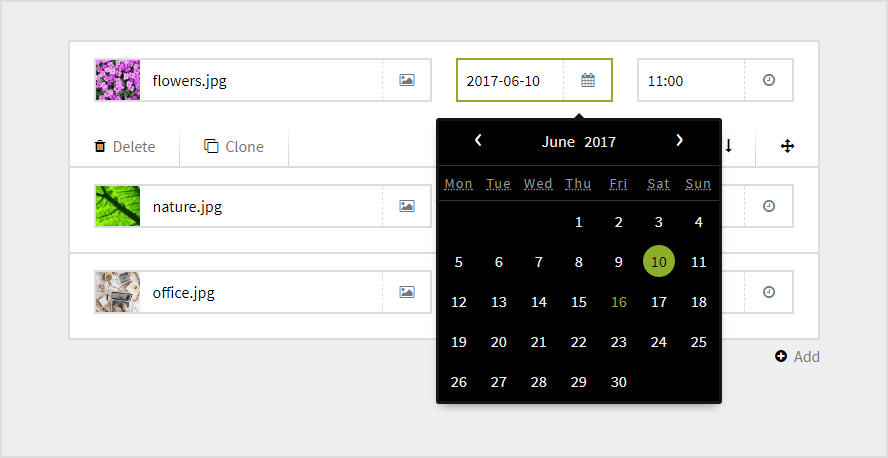
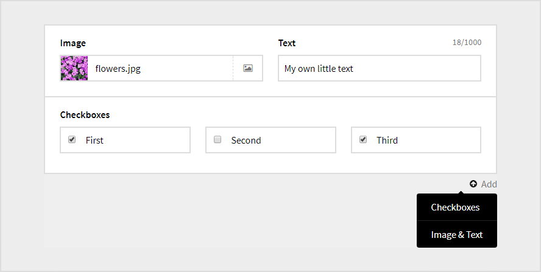
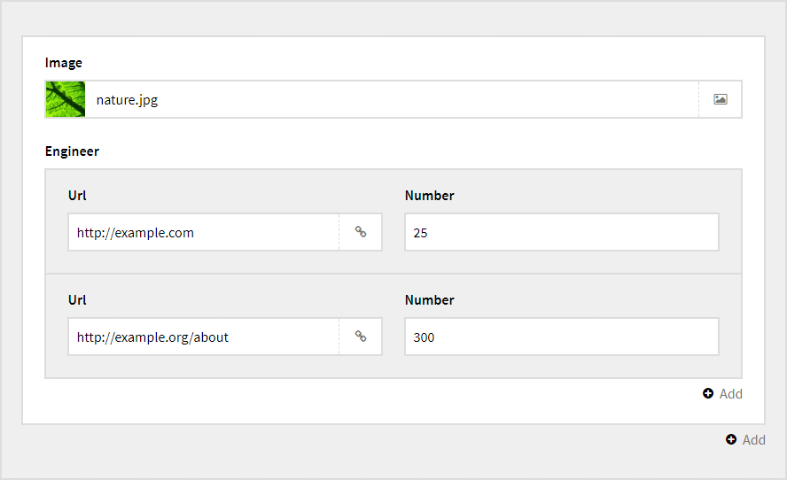
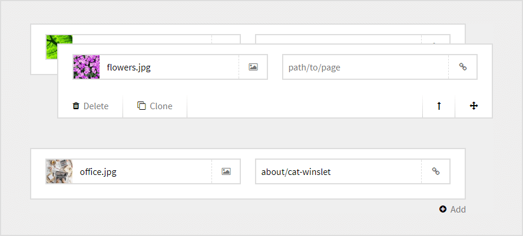

# Screenshots

Here are some different examples of what you can do.

**Field rows**

Add an unlimted number of rows with fields.

**Fieldsets**

If needed, you can use a set of fields to output different kind of field rows.

**Nesting**

It's possible nest Engineer fields in the blueprint. There is no depth limit.

**Sorting**

Sort the rows by drag and drop or by the sort arrows.

