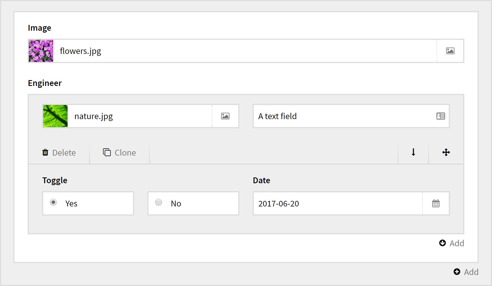

# Kirby Engineer Field

 

A [Kirby CMS](https://getkirby.com) field for complex field structures.

**Supports:**

- Nesting
- Fieldsets
- Inline editing
- Sorting
- Cloning

**Engineer example**

You can have pretty much any field structure you want. Also see the [blueprint](docs/examples.md) for this screenshot.

[See more screenshots](docs/screenshots.md)

## Table of contents

1. **Get started**
  1. [Install](docs/install.md)
  1. [Blueprint](docs/blueprint.md)
  1. [Usage](docs/usage.md)
  1. [Templates and snippets](docs/blueprint.md)
1. **More**
  - [Supported fields](docs/fields.md)
  - [Options](docs/options.md)
  - [Comparation](docs/compare.md) (to similar fields)
  - [Changelog](docs/changelog.md)
1. **Advanced**
  - [For plugin developers](docs/advanced-for-plugin-developers.md)

## Requirements

- [**Kirby**](https://getkirby.com/) 2.4.1+
- A modern browser like [Chrome](https://www.google.se/chrome/browser/desktop/index.html), [Firefox](https://www.mozilla.org/firefox/new/) or [Edge](https://www.microsoft.com/windows/microsoft-edge) (Internet Explorer does not work).

## Disclaimer

This plugin is provided "as is" with no guarantee. Use it at your own risk and always test it yourself before using it in a production environment. If you find any issues, please [create a new issue](https://github.com/jenstornell/field-engineer/issues/new).

## Purchase

Be sure to try before you buy. Refunds are not supported. Read more in the [license agreement](docs/license.md).

**Price:** 50 EUR (on each project)

## Credits

- [Jens Törnell](https://github.com/jenstornell)
- [Sonja Broda](https://github.com/texnixe) - For the great forum support
- [Lukas Bestle](https://github.com/lukasbestle) - For the great forum support and Kirby development
- [Bastian Allgeier](https://github.com/bastianallgeier) - For building Kirby which makes this plugin possible